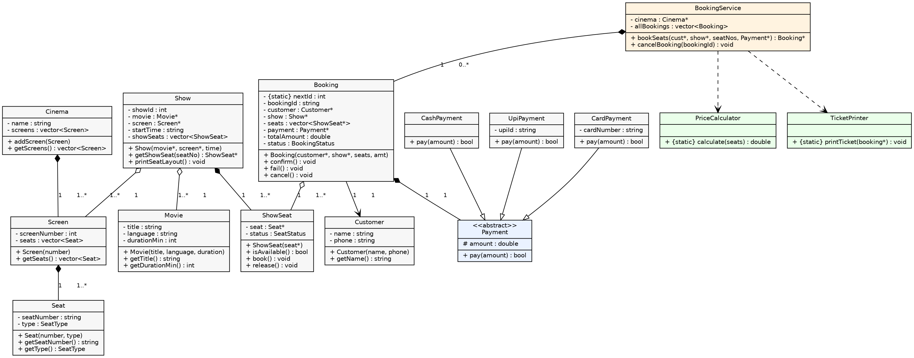
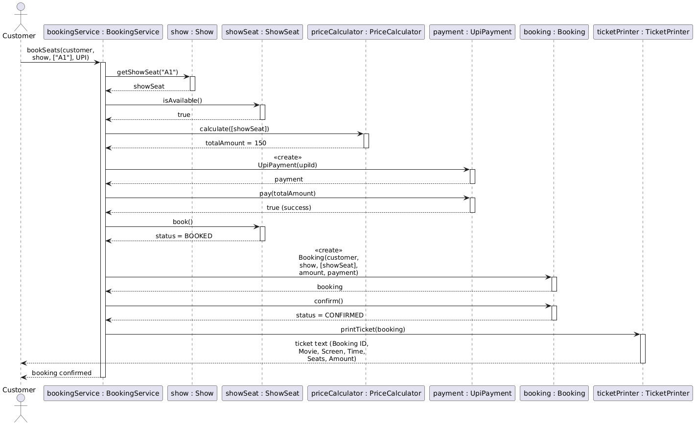

# movie-ticket-booking-cpp

A menu-driven console app for booking movie tickets at a single cinema, built as a system design exercise (OOP + UML + SOLID). Handles browsing shows, picking seats, paying, printing a ticket, and cancelling a booking.

```
===== MOVIE TICKET BOOKING =====
1. Movies  2. Book  3. Cancel  4. My tickets   0. Exit
Choose: 1

  [1] 3 Idiots        Hindi   170 min
  [2] Interstellar     English 169 min
```

## Features

- Browse movies and their shows (screen + time)
- Seat map per show, grouped by type (SILVER / GOLD / PLATINUM)
- Book one or more seats — rejects the whole booking if any seat is already taken
- Pay by UPI, Card, or Cash — a failed payment doesn't confirm the booking
- Printed ticket with booking id, movie, screen, time, seats, amount
- Cancel a booking — seats go back to AVAILABLE

## Design

Built around 14 classes, each with one job — `Movie`, `Seat`, `Screen`, `Cinema`, `Show`, `ShowSeat`, `Customer`, `Booking`, the `Payment` hierarchy (abstract base + UPI/Card/Cash), `PriceCalculator`, `TicketPrinter`, and `BookingService` as the orchestrator.

The one modeling decision worth calling out: seat availability lives on `ShowSeat`, not `Seat`, because the same physical seat (A1) can be booked for the 6PM show and free for the 9PM show — status belongs to the show, not the chair.

**Class diagram:**



**Sequence diagram** (booking a seat + paying by UPI):



### Relationships, briefly

| Pair | Type | Why |
|---|---|---|
| Cinema – Screen | Composition | Screen has no meaning outside its Cinema |
| Screen – Seat | Composition | Screen builds its own seats |
| Show – Movie | Aggregation | Show borrows a Movie; cancelling a show doesn't delete the movie |
| Show – ShowSeat | Composition | Each show owns its own booking status per seat |
| Booking – Customer | Association | Customer exists independently of any one booking |
| Booking – Payment | Composition | Payment instance is created for that one booking attempt |

### SOLID

- **SRP** — Booking doesn't price itself or print itself
- **OCP** — new payment method = new class extending `Payment`, nothing else changes
- **LSP** — any `Payment` subclass works through a plain `Payment*`
- **ISP** — `Payment` only forces `pay()`, not a `refund()` every method may not support

One thing I didn't do: full dependency inversion for payment creation. `main.cpp` builds the concrete `UpiPayment`/`CardPayment`/`CashPayment` directly off the menu choice rather than depending on an injected factory. Fine for a single console app — would revisit if this grew (e.g. for unit testing with mock payments).

## Build & run

One class per file, no headers — files are `#include`d directly in dependency order (`main.cpp` pulls everything in).

```bash
g++ -std=c++17 main.cpp -o booking_system
./booking_system
```

## Project structure

```
.
├── 01_Movie.cpp
├── 02_Seat.cpp
├── 03_Screen.cpp
├── 04_Cinema.cpp
├── 05_Show.cpp
├── 06_ShowSeat.cpp
├── 07_Customer.cpp
├── 08_Booking.cpp
├── 09_Payment.cpp
├── 10_PaymentTypes.cpp
├── 11_PriceCalculator.cpp
├── 12_TicketPrinter.cpp
├── 13_BookingService.cpp
├── main.cpp
└── docs/
    ├── class_diagram.png
    └── sequence_diagram.png
```
